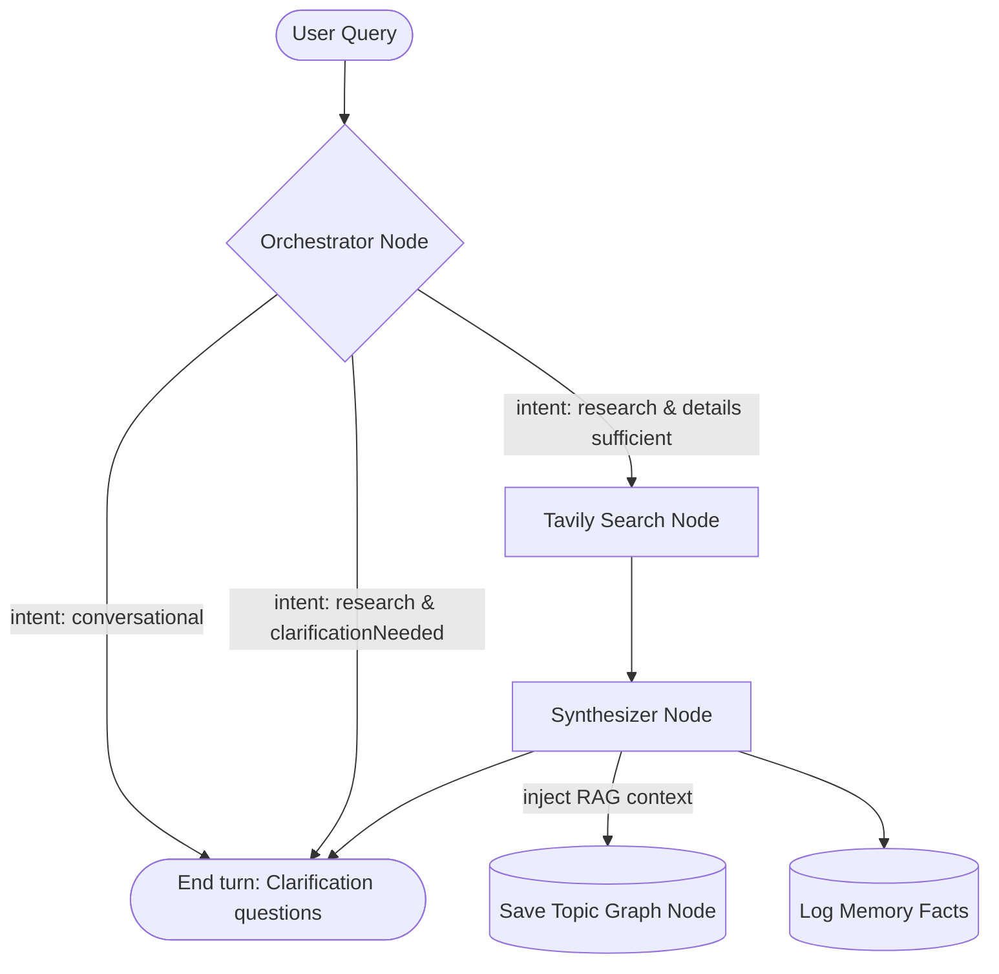

# Semantic Research Graph and Multi-Tab Memory Agent

An advanced research workspace that maps human inquiry into a non-linear semantic knowledge graph. Powered by a multi-agent LangGraph workflow, custom memory scoping paths, native safety guardrails, and interactive SVG visualizations.

---

## Tech Stack and Services

*   **Frontend Core**: Next.js 16 (App Router), React 19, TypeScript, TailwindCSS.
*   **Database and Authentication**: Neon PostgreSQL, Neon Auth (Server Session Middleware).
*   **ORM**: Drizzle ORM.
*   **LLM Orchestration**: Groq Cloud API with dynamic model selection and failover retry mechanisms.
*   **Deep Web Search**: Tavily Search API (parallel query planning).
*   **Long-Term Memory**: Mem0 Platform API with local PostgreSQL schema fallbacks.
*   **Graph Visualizations**: Custom force-directed gravity simulations inside React SVG.

---

## Core Features and Integrations

### 1. Document Vector Indexing and RAG (Retrieval-Augmented Generation)
The workspace supports uploading PDF documents, extracting their text, and converting them into dense vector embeddings for semantic search retrieval.
*   **Text Ingestion**: Uploaded PDF streams are parsed dynamically on the server. The raw text is extracted and normalized.
*   **Chunking Strategy**: The extracted text is split into chunks of approximately 750 characters, with a 150-character sliding overlap to preserve context across boundaries.
*   **Server-Side Embeddings**: Vector embeddings are calculated natively on the server using the `all-MiniLM-L6-v2` transformer model (via the `@xenova/transformers` WebAssembly runtime). This generates 384-dimensional dense vectors without requiring external OpenAI or HuggingFace API calls.
*   **Vector Storage (pgvector)**: Text chunks and their corresponding embeddings are stored in a `pdf_chunks` PostgreSQL table utilizing the native Neon `pgvector` database extension.
*   **Similarity Search**: During a chat session, a query vector is generated. The system executes a cosine distance vector similarity query (`embedding <=> queryVector`) in SQL to pull the top 5 closest chunks (filtering out items with a distance score greater than 0.75). The retrieved context is appended directly to the LLM system prompt.

### 2. Multi-Model Selector
Users can change the active reasoning model dynamically via a custom dropdown component in the chat header. The system routes the requests across the following available model identifiers:
*   **Groq**: `groq/compound`, `groq/compound-mini`
*   **Meta**: `meta-llama/llama-prompt-guard-2-2b`, `meta-llama/llama-prompt-guard-2-8b`
*   **OpenAI**: `openai/gpt-oss-120b`, `openai/gpt-oss-20b`, `openai/gpt-oss-safeguard-20b`
*   **Whisper**: `whisper-large-v3`, `whisper-large-v3-turbo`

The selected model parameter is submitted inside the request body, stored within the LangGraph state annotation, and used to override the default Groq inference target.

### 3. Native Safety Guardrails
To prevent malicious prompts and moderate generated reports, the application implements safety checks powered by Meta Llama Guard models:
*   **Safety Engine**: Prompts and completions are evaluated using `llama-guard-3-8b` or `meta-llama/llama-guard-4-12b` hosted on Groq's high-speed inference engines.
*   **Input Moderation**: Checks user queries for prompt injections, jailbreaks, harassment, cyberattacks, or violence. If unsafe content is detected, the workflow is aborted and a policy warning is returned.
*   **Output Moderation**: Synthesized markdown reports are screened to prevent outputting violations, safeguarding compliance before content is rendered on the frontend.

### 4. Memory Management and Tab Scoping
The system supports multiple parallel chat tabs within the same research project. Each tab runs in isolated memory scopes:
*   **Research Card Memory (Default)**: Restricts the agent's memory queries exclusively to facts logged inside the active research card.
*   **All Workspace Memory**: Connects the tab to the broader workspace context, allowing cross-card learning and fact-sharing.
*   **Custom Topic Nodes (Selective Knowledge Paths)**: Restricts memory to specific topic nodes chosen by the user in the graph. The agent ignores facts from all other topics.
*   **Aligned Topic Scoping**: Resolves mismatches between developer-friendly query slugs (e.g. `gaming-laptop`) and user-facing topic titles (e.g. `Gaming Laptops`) via semantic queries on Mem0 Cloud and fuzzy matching inside the local database fallback.

---

## LangGraph Workflow Architecture

The agent runs as a compiled `StateGraph` state machine with discrete processing nodes:

### 1. Orchestrator Node (Intent and Clarification)
*   **Role**: Classifies user query intent and evaluates information sufficiency.
*   **Classification Scopes**:
    1.  `conversational`: Small talk, greetings, or questions asking about user preferences, choices, or past research selections that can be answered from active memory.
    2.  `research`: Requests to compare, analyze, or deep dive into a subject.
*   **Clarification Check**: If details are missing, the orchestrator generates 1-3 highly-specific multiple-choice questions instead of running search.

### 2. Tavily Search Node (Web Querying)
*   **Role**: Plans parallel search strategies, fires multiple targeted web queries, and consolidates scraped snippet results.

### 3. Synthesizer Node (Report Generation)
*   **Role**: Compiles web findings, user choices, RAG document context, and historical memories into a publication-grade markdown report.
*   **Outputs**: Generates a single output containing two formats:
    *   **Markdown Body**: Detailed prose, comparison tables, and `json-chart` blocks.
    *   **`json-metadata` Code Block**: Structured topic details (`topicMetadata`), citation sources, related study suggestions, and learned user facts.

---

## Interactive SVG Knowledge Graphs

To visualize research progress as a semantic graph rather than a linear chat log:
*   **Workspace Map View**: Accessible via "Workspace Graph" in the left sidebar. It fetches workspace-wide topics and highlights connections between research cards.
*   **Interactive D3 Physics**: Coordinates are managed as state. Custom mouse events (`onMouseDown`, `onMouseMove`, `onMouseUp`) update node positions dynamically. Lines automatically recalculate to follow the nodes.
*   **Smart Highlighting**: Clicking any topic node in the right sidebar or full-screen workspace graph triggers a window callback event. The main chat area automatically expands the corresponding turn card, scrolls it into view, and displays an emerald ring pulse animation.
