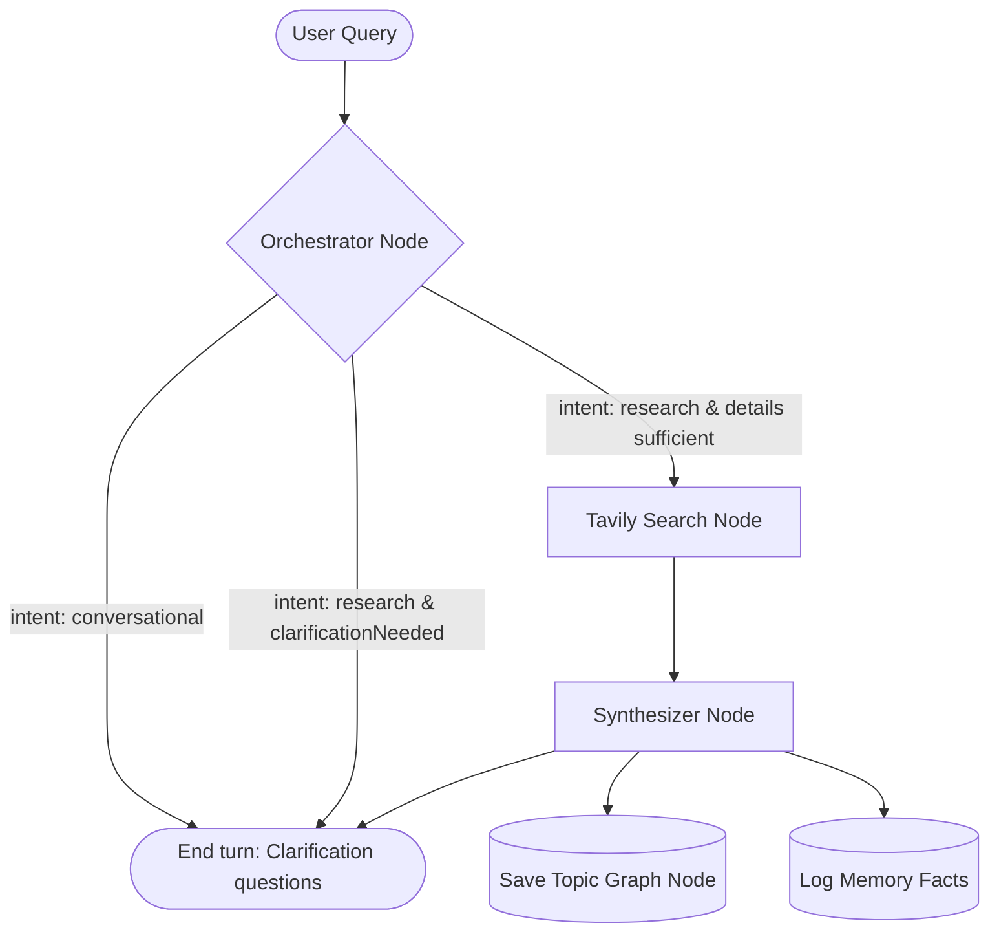
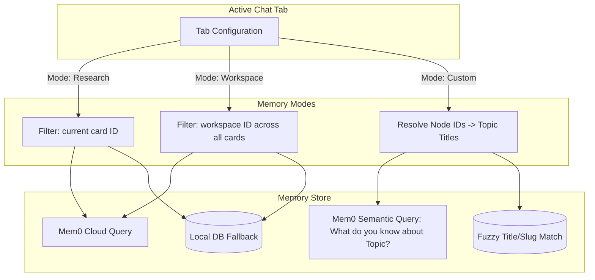

# Semantic Research Graph & Multi-Tab Memory Agent

An advanced, premium research workspace that maps human inquiry into a non-linear semantic knowledge graph. Powered by a multi-agent LangGraph workflow, custom memory scoping paths (via Mem0), and interactive SVG visualizations.

---

## 🛠️ Tech Stack & Services

*   **Frontend Core**: Next.js 16 (App Router), React 19, TypeScript, TailwindCSS.
*   **Database & Auth**: Neon PostgreSQL, Neon Auth (Server Session Middleware).
*   **ORM**: Drizzle ORM.
*   **LLM Orchestrator**: Groq Cloud API (utilizing LLaMA 3.3 models) with failover retry mechanisms.
*   **Deep Web Search**: Tavily Search API (parallel query planning).
*   **Long-Term Memory**: Mem0 Platform API with local PostgreSQL schema fallbacks.
*   **Graph Visualizations**: Custom D3-inspired force-directed gravity simulations inside React SVG.

---

## 🧠 LangGraph Workflow Architecture

The agent runs as a compiled `StateGraph` state machine with discrete processing nodes:

### 1. Orchestrator Node (Intent & Clarification)
*   **Role**: Classifies user query intent and evaluates information sufficiency.
*   **Classification Scopes**:
    1.  `conversational`: Small talk, greetings, or questions asking about user preferences, choices, or past research selections that can be answered from active memory.
    2.  `research`: Requests to compare, analyze, or deep dive into a new topic.
*   **Clarification Check**: If details are missing, the orchestrator generates 1-3 highly-specific multiple-choice questions instead of running search.

### 2. Tavily Search Node (Web Querying)
*   **Role**: Plans parallel search strategies, fires multiple targeted web queries, and consolidates scraped snippet results.

### 3. Synthesizer Node (Report Generation)
*   **Role**: Compiles web findings, user choices, and historical memories into a publication-grade markdown report.
*   **Outputs**: Generates a single output containing two formats:
    *   **Markdown Body**: Detailed prose, comparison tables, and `json-chart` blocks.
    *   **`json-metadata` Code Block**: Structured topic details (`topicMetadata`), citation sources, related study suggestions, and learned user facts.

---

## 📂 Memory Management & Tab Scoping

The system supports multiple parallel chat tabs within the same research project. Each tab runs in isolated memory scopes:

### 1. Memory Isolation Modes
*   **This Research Card Memory (Default)**: Restricts the agent's memory queries exclusively to facts logged inside the active research card.
*   **All Workspace Memory**: Connects the tab to the broader workspace context, allowing cross-card learning and fact-sharing.
*   **Custom Topic Nodes (Selective Knowledge Paths)**: Restricts memory to specific topic nodes chosen by the user in the graph. The agent will ignore facts from all other topics.

### 2. Aligned Topic Scoping
To resolve mismatches between developer-friendly query slugs (e.g. `gaming-laptop`) and user-facing topic titles (e.g. `Gaming Laptops`):
*   **Mem0 Cloud**: Filters are searched semantically (`What do you know about <Topic>?`) rather than exact keyword matches, enabling the model to retrieve facts regardless of slug variations.
*   **Local DB Fallback**: Re-routes queries to query all workspace cards matching the chosen topics, executing a fuzzy match on both the title and slug variations (e.g., `gaming-laptops`).

---

## 🎨 Click-to-Highlight & Draggable SVG Knowledge Graphs

To visualize research progress as a semantic graph rather than a linear chat log:
*   **Workspace Map View**: Accessible via "Workspace Graph" in the left sidebar. It fetches workspace-wide topics and highlights connections between research cards.
*   **Interactive D3 Physics**: Coordinates are managed as state. Custom mouse events (`onMouseDown`, `onMouseMove`, `onMouseUp`) update node positions dynamically. Lines automatically recalculate to follow the nodes.
*   **Smart Highlighting**: Clicking any topic node in the right sidebar or full-screen workspace graph triggers a window callback event. The main chat area automatically expands the corresponding turn card, scrolls it into view, and displays an emerald ring pulse animation.
